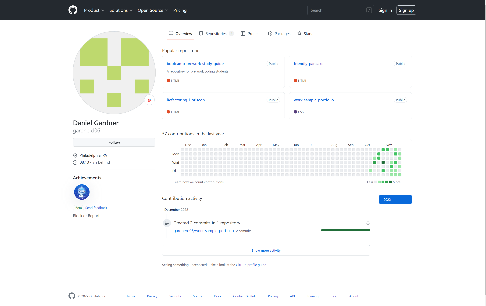

# Work-sample-portfolio

This work sample portfolio is a app built to showcase my current skill level in coding using HTML and CSS.

Description

The purpose of the Work portfolio project was to create code and artistically express my skills by crafting this webpage to showcase my proficiency. All code has been thoroughly reviewed and structured in proper syntax. I created multiple pages and included multple links to create a fluid webpage that's also user friendly. All code and links have been tested for functionality.

Installation

Code for this program can be downloaded from: https://github.com/gardnerd06/work-sample-portfolio

Screenshots

.png>)
License

MIT LICENSE INCLUDED IN ROOT FILE.

[def]: main/Photos/Preview/Code.png
